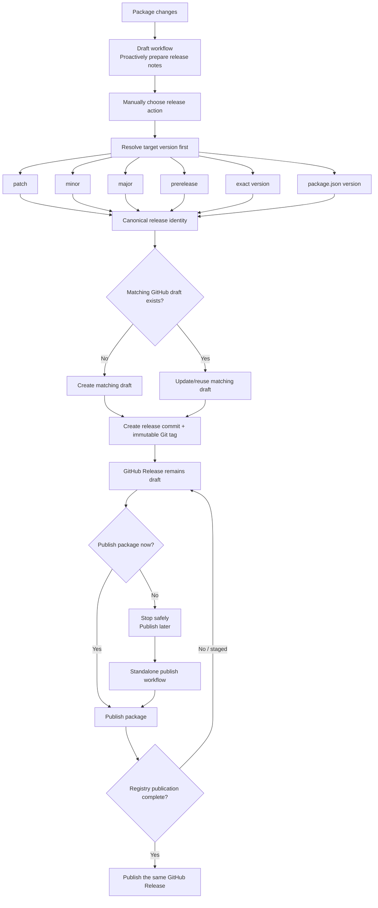

# Package release workflow

The repository release system separates **drafting**, **releasing**, and **publishing** into distinct stages of one package release lifecycle.

The draft workflow prepares release notes proactively. The release workflow determines the exact target version and ensures the correct draft exists. Publishing completes the package release and promotes that same GitHub Release from draft to published.

## Release lifecycle

```text
package changes
    ↓
Draft workflow - Proactively prepare release notes
    ↓
manually choose release action
    ↓
resolve target version first
    ├─ patch
    ├─ minor
    ├─ major
    ├─ prerelease
    ├─ exact version
    └─ package.json version
    ↓
canonical release identity
    ↓
ensure matching GitHub draft exists
    ├─ create it if missing
    └─ update/reuse it if present
    ↓
create release commit + immutable Git tag
    ↓
GitHub Release remains draft
    ↓
publish package
    ↓
publish that same GitHub Release
```



The automatic draft is preparation, not a hard prerequisite. A manual release can create the exact target-version draft when one does not already exist.

## Release draft

A **release draft** is the GitHub Release record used to prepare and review release notes before the package is published.

It is intentionally separate from the Git tag and package registry publication.

A draft contains:

- the canonical GitHub Release name
- the canonical package Git tag
- package-specific release notes
- the target branch
- an installation command

For example:

```text
Release name:
@moyarich/foo v0.1.1

Tag:
packages/foo@0.1.1

State:
draft
```

### What creates the draft?

There are two ways a draft can be created.

#### Automatic draft workflow

The draft workflow proactively prepares release notes from merged work:

```text
main changes
    ↓
Draft package releases
    ↓
prepares/updates likely next release draft
```

This gives maintainers an early place to review and edit release notes.

#### Release workflow

The release workflow does not require that the automatic draft already exists.

It first resolves the requested target version, then:

- reuses the exact matching draft when one exists
- updates its canonical name, tag, and target metadata when needed
- preserves existing draft notes when reusing a draft
- creates the exact matching draft when none exists

This allows bump releases to work even when the automatic draft was prepared for a different version or no draft was created at all.

### What owns the draft?

The GitHub Release draft is the authoritative release record for that package version.

The same record moves through the lifecycle:

```text
draft created
    ↓
release commit/tag created
    ↓
package published
    ↓
same GitHub Release becomes published
```

Publishing does not create a second GitHub Release.

### Why does the release stay in draft mode after tagging?

Creating a Git tag proves that a version exists in Git. It does not prove that the package was successfully published to a registry.

Keeping the GitHub Release in draft mode prevents this misleading state:

```text
GitHub Release: published
Package registry: failed or incomplete
```

The public GitHub Release therefore represents completed package publication, not merely completed Git tagging.

## Canonical release identity

Draft, release, and publish workflows use the same identity generated by `@moyarich/workspace-tools`.

```text
Git tag:             <package-directory>@<version>
GitHub Release name: <package-name> v<version>
```

Example:

```text
Package name:        @moyarich/auto-glow-md
Package directory:   packages/moyarich-auto-glow-md
Version:             0.1.0

Git tag:             packages/moyarich-auto-glow-md@0.1.0
GitHub Release name: @moyarich/auto-glow-md v0.1.0
```

Use the shared CLI when another tool or workflow needs these values:

```sh
workspace-release-identity packages/moyarich-auto-glow-md \
  --version 0.1.0 \
  --json
```

Do not reproduce the tag or release-name formula independently in workflow YAML or shell scripts.

## 1. Resolve the target version

`.github/workflows/reusable_npm-release.yml` resolves the target version before any release mutation.

It invokes `workspace-release` in dry-run mode first.

The preview resolves:

- current package version
- requested release mode
- target version
- canonical release identity
- Git-tag readiness
- registry readiness
- proposed changelog content

Supported release choices include:

```text
patch
minor
major
prepatch
preminor
premajor
prerelease
exact version
package.json version
```

If the target is already published or its immutable Git tag already exists, the real release is blocked.

## 2. Ensure the matching draft

Once the target version is known, the release workflow looks for a GitHub Release draft with the exact canonical tag.

### Matching draft exists

The workflow reuses it.

Existing release notes are preserved so manual edits are not overwritten.

The workflow can still normalize:

- release name
- tag metadata
- target branch
- draft state

### Matching draft does not exist

The workflow creates one using:

- canonical release name
- canonical release tag
- resolved target branch
- proposed changelog from the release preview
- exact package installation command

A missing draft therefore does **not** block a bump release.

### Published release already exists

A published GitHub Release for the same canonical tag blocks the release attempt.

The workflow will not recreate or move an existing published release.

## 3. Create the package release

After the draft exists, the real release runs with the same version request used by the preview.

The real release must resolve the same canonical identity as the preview.

The release operation can:

- update `package.json`
- update release files or changelog
- create the release commit
- create the immutable package Git tag

The commit and tag are pushed only after the release checks succeed.

## Release-only

If:

```text
publish=false
```

the lifecycle stops safely after the release commit and tag:

```text
resolve target version
    ↓
ensure matching draft
    ↓
create release commit/tag
    ↓
GitHub Release stays draft
```

The package can be published later with the standalone publish workflow.

## Release + publish

If:

```text
publish=true
```

the same workflow continues:

```text
resolve target
    ↓
ensure matching draft
    ↓
release/tag
    ↓
publish package
    ↓
publish existing GitHub Release
```

The GitHub Release becomes public only after package publication succeeds.

## 4. Publish the package

Package publication uses `workspace-publish` through either:

- the combined release workflow
- `.github/workflows/reusable_npm-publish.yml`

Publishing verifies the canonical package tag by default:

```text
<package-directory>@<package.json version>
```

The tag must exist and point to the expected commit unless tag verification is explicitly disabled.

A standalone publish also verifies the matching GitHub draft. This allows a release-only run to be completed later without recreating release state.

## 5. Finalize the GitHub Release

After registry publication succeeds, the existing GitHub Release draft is promoted:

```text
draft=true
    ↓
package publication succeeds
    ↓
draft=false
```

The workflow preserves the same:

- release ID
- tag
- release name
- release notes

Only the publication state changes.

### npm staged publication

npm publication can enter a staged state before publication is fully complete.

When that happens:

```text
npm publication: staged
GitHub Release:  draft
```

The GitHub Release remains a draft until registry publication is complete.

## Patch bump example

For a package currently at `0.1.0`:

```text
current package:
0.1.0

release request:
patch

resolved target:
0.1.1

draft created/updated:
@moyarich/foo v0.1.1

canonical tag:
packages/foo@0.1.1

then:
release → publish package → publish GitHub Release
```

The important workflow change is:

```text
OLD
draft must already exist
    ↓
release

NEW
resolve target version
    ↓
ensure draft exists
    ↓
release
```

That preserves bumping while still preventing orphaned tags.

## After publication

A published GitHub Release remains editable:

```text
published release
    ├─ edit title ✓
    ├─ edit notes ✓
    ├─ add assets ✓
    └─ move release tag ✗
```

The immutable release identity is:

```text
package version + Git tag
```

Release notes are not immutable.

Editing a published GitHub Release does not require moving or recreating its Git tag.

## Valid release states

| Git tag | Draft release | Published release | Meaning                         |
| ------- | ------------- | ----------------- | ------------------------------- |
| no      | no            | no                | No release prepared yet         |
| no      | yes           | no                | Normal pre-release draft        |
| yes     | yes           | no                | Valid release in progress       |
| yes     | no            | yes               | Completed release               |
| yes     | no            | no                | Orphan tag; workflow blocks     |
| yes     | yes           | yes               | Inconsistent state; investigate |

A Git tag with a matching draft is valid because release-only runs intentionally leave the release in that state.

A Git tag with neither a matching draft nor a published GitHub Release is an orphan and requires reconciliation.

## Workflow responsibilities

| Stage                        | Responsibility                                     |
| ---------------------------- | -------------------------------------------------- |
| Draft workflow               | Proactively prepare release notes                  |
| Release workflow             | Resolve target version and ensure its draft exists |
| `workspace-release-identity` | Produce canonical release name and Git tag         |
| Release operation            | Version, commit, and create immutable Git tag      |
| Publish operation            | Publish package                                    |
| Finalization                 | Change existing GitHub Release draft to published  |

## Safety rules

Release tooling should preserve these invariants:

1. Draft, release, and publish use the same canonical release identity.
2. Target version resolution happens before any release mutation.
3. A matching draft is created automatically when none exists.
4. Existing matching draft notes are preserved when the draft is reused.
5. Release tags are immutable and are never force-moved.
6. Package publishing verifies the canonical release tag by default.
7. Release-only runs leave the GitHub Release as a draft.
8. The GitHub Release is published only after package publication succeeds.
9. Staged npm publication does not publish the GitHub Release.
10. A tag without a matching draft or published release is treated as an orphan.
11. Dry runs do not mutate repository, registry, Git tag, or GitHub Release state.

## Typical patch release

```text
1. Merge package changes to main.
2. Draft workflow proactively prepares release notes.
3. Manually run Release with patch selected.
4. Release preview resolves 0.1.1.
5. Canonical identity resolves:
   @moyarich/example v0.1.1
   packages/example@0.1.1
6. Release workflow creates or reuses the 0.1.1 GitHub draft.
7. Release operation creates the release commit and immutable tag.
8. GitHub Release remains a draft.
9. Publish now or later.
10. After package publication succeeds, the same GitHub Release is published.
```
