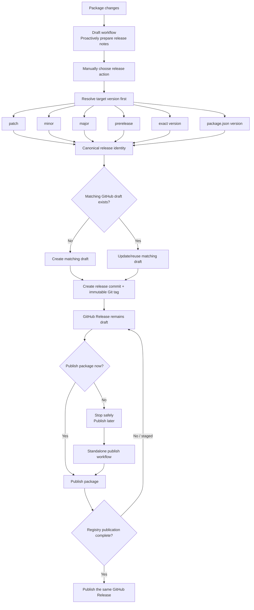

# Package release workflow

The repository release system treats drafting, releasing, and publishing as separate stages of one package release lifecycle.

The draft workflow prepares release notes proactively, while the release workflow remains authoritative for the target version actually being released.

## Release lifecycle

The better workflow is:

```text
package changes
    ↓
Draft workflow - Proactively prepare release notes
    ↓
manually choose release action
    ↓
resolve target version first
    ├─ patch
    ├─ minor
    ├─ major
    ├─ prerelease
    ├─ exact version
    └─ package.json version
    ↓
canonical release identity
    ↓
ensure matching GitHub draft exists
    ├─ create it if missing
    └─ update/reuse it if present
    ↓
create release commit + immutable Git tag
    ↓
GitHub Release remains draft
    ↓
publish package
    ↓
publish that same GitHub Release
```



The automatic draft is useful preparation, but it is not a hard prerequisite. The release workflow resolves the requested target version and ensures the exact matching draft exists before creating the release tag.

## Patch bump example

For a patch bump:

```text
current package:
0.1.0

release request:
patch

resolved target:
0.1.1

draft created/updated:
@moyarich/foo v0.1.1

canonical tag:
packages/foo@0.1.1

then:
release → publish package → publish GitHub Release
```

The important change is:

```text
OLD
draft must already exist
    ↓
release

NEW
resolve target version
    ↓
ensure draft exists
    ↓
release
```

That preserves bumping while still preventing orphaned tags.

## Canonical release identity

Draft, release, and publish workflows use the same release identity generated by `@moyarich/workspace-tools`.

The rules are:

```text
Git tag:             <package-directory>@<version>
GitHub Release name: <package-name> v<version>
```

For example:

```text
Package name:        @moyarich/auto-glow-md
Package directory:   packages/moyarich-auto-glow-md
Version:             0.1.0

Git tag:             packages/moyarich-auto-glow-md@0.1.0
GitHub Release name: @moyarich/auto-glow-md v0.1.0
```

Use the shared CLI when another workflow or tool needs these values:

```sh
workspace-release-identity packages/moyarich-auto-glow-md \
  --version 0.1.0 \
  --json
```

Do not reproduce the tag or release-name formula independently in workflow YAML or shell scripts.

## Release-only

If you choose:

```text
publish=false
```

then:

```text
resolve target version
    ↓
ensure draft
    ↓
create commit/tag
    ↓
GitHub Release stays draft
```

You can publish later with the standalone publish workflow.

The Git tag exists at this point, but the GitHub Release intentionally remains a draft because package publication has not completed.

## Release + publish

If:

```text
publish=true
```

then:

```text
resolve target
    ↓
ensure draft
    ↓
release/tag
    ↓
publish package
    ↓
publish existing GitHub Release
```

The same GitHub Release record is used throughout the process. Publishing does not create a second release.

## Draft workflow

The automatic draft workflow still has value. It continuously prepares release notes from merged work:

```text
main changes
    ↓
Draft package releases
    ↓
prepares/updates likely next release draft
```

It is no longer a hard prerequisite.

When a manual release is started, the release workflow independently resolves the requested target version. It then:

- reuses the exact matching draft when one exists
- updates its canonical name, tag, and target metadata when needed
- preserves existing draft notes when reusing a draft
- creates the matching draft from the resolved release preview when none exists

This means an automatically prepared draft can help with release-note editing, but choosing `patch`, `minor`, `major`, a prerelease, an exact version, or the current package version still works even when no matching draft existed beforehand.

## Target version resolution

`.github/workflows/reusable_npm-release.yml` resolves the target before any release mutation.

It invokes `workspace-release` in dry-run mode first. That preview provides:

- current package version
- resolved target version
- canonical release identity
- Git-tag readiness
- registry readiness
- proposed changelog content

Only after the target is known does the workflow ensure the matching GitHub draft exists.

If the target is already published or its immutable Git tag already exists, the real release is blocked rather than creating or moving release state.

## Ensuring the matching draft

For a real release, the workflow searches for the exact canonical tag.

If a matching draft exists, it is reused. Its existing notes are preserved so manually edited release notes are not overwritten.

If no matching draft exists, the workflow creates one using:

- the canonical release name
- the canonical release tag
- the resolved target branch
- the proposed changelog from the release preview
- the exact package installation command

A published GitHub Release with the same target tag blocks a new release attempt.

## Package release

After the draft is ensured, the real release operation runs with the same version request that produced the preview.

The real release must return the same canonical tag and release name resolved by the preview.

The operation then:

- updates the package version when required
- updates release files/changelog when required
- creates the release commit
- creates the immutable package Git tag

The commit and tag are pushed only after those checks succeed.

## Package publishing

Package publication uses `workspace-publish` through either the combined release workflow or `.github/workflows/reusable_npm-publish.yml`.

Publishing verifies the canonical package tag by default:

```text
<package-directory>@<package.json version>
```

The tag must exist and point to the expected commit unless tag verification is explicitly disabled.

A standalone publish also verifies the matching GitHub draft. This allows a release-only run to be completed later without recreating the release.

## npm staged publication

npm publication can enter a staged state before the registry release is fully complete.

When publication is staged:

```text
npm publication: staged
GitHub Release:  draft
```

The GitHub Release is promoted only after registry publication is complete.

## After publication

The GitHub Release remains editable:

```text
published release
    ├─ edit title ✓
    ├─ edit notes ✓
    ├─ add assets ✓
    └─ move release tag ✗
```

The immutable part should be:

```text
package version + Git tag
```

not the release notes.

Editing a published GitHub Release does not require moving or recreating its release tag.

## Valid release states

| Git tag | Draft release | Published release | Meaning                         |
| ------- | ------------- | ----------------- | ------------------------------- |
| no      | no            | no                | No release prepared yet         |
| no      | yes           | no                | Normal pre-release draft        |
| yes     | yes           | no                | Valid release in progress       |
| yes     | no            | yes               | Completed release               |
| yes     | no            | no                | Orphan tag; workflow blocks     |
| yes     | yes           | yes               | Inconsistent state; investigate |

A Git tag with a matching draft is deliberately accepted because release-only runs leave the release in that state.

A Git tag with neither a matching draft nor a published GitHub Release is treated as an orphan and requires reconciliation.

## Workflow responsibilities

| Stage                        | Responsibility                                        |
| ---------------------------- | ----------------------------------------------------- |
| Draft workflow               | Proactively prepare release notes                     |
| Release workflow             | Resolve target version and ensure its draft exists    |
| `workspace-release-identity` | Produce canonical name/tag                            |
| Release operation            | Version, commit, tag                                  |
| Publish operation            | Publish package                                       |
| Finalization                 | Change existing GitHub Release from draft → published |

## Safety rules

Release tooling should preserve these invariants:

1. Draft, release, and publish use the same canonical release identity.
2. The release workflow resolves the target version before creating or reusing a draft.
3. A matching draft is created automatically when none exists.
4. Existing matching draft notes are preserved when the draft is reused.
5. Release tags are immutable and are never force-moved.
6. Package publishing verifies the canonical release tag by default.
7. Release-only runs leave the GitHub Release as a draft.
8. The GitHub Release is published only after package publication succeeds.
9. Staged npm publication does not publish the GitHub Release.
10. A tag without a matching draft or published release is treated as an orphan.
11. Dry runs do not mutate repository, registry, tag, or GitHub Release state.

## Typical patch release

For a package currently at `0.1.0`:

```text
1. Merge package changes to main.
2. Draft workflow proactively prepares release notes.
3. Manually run Release with patch selected.
4. Release preview resolves 0.1.1.
5. Canonical identity resolves:
   @moyarich/example v0.1.1
   packages/example@0.1.1
6. Release workflow creates or reuses the 0.1.1 GitHub draft.
7. Release operation creates the release commit and immutable tag.
8. GitHub Release remains a draft.
9. Publish now or later.
10. After package publication succeeds, the existing GitHub Release is published.
```
